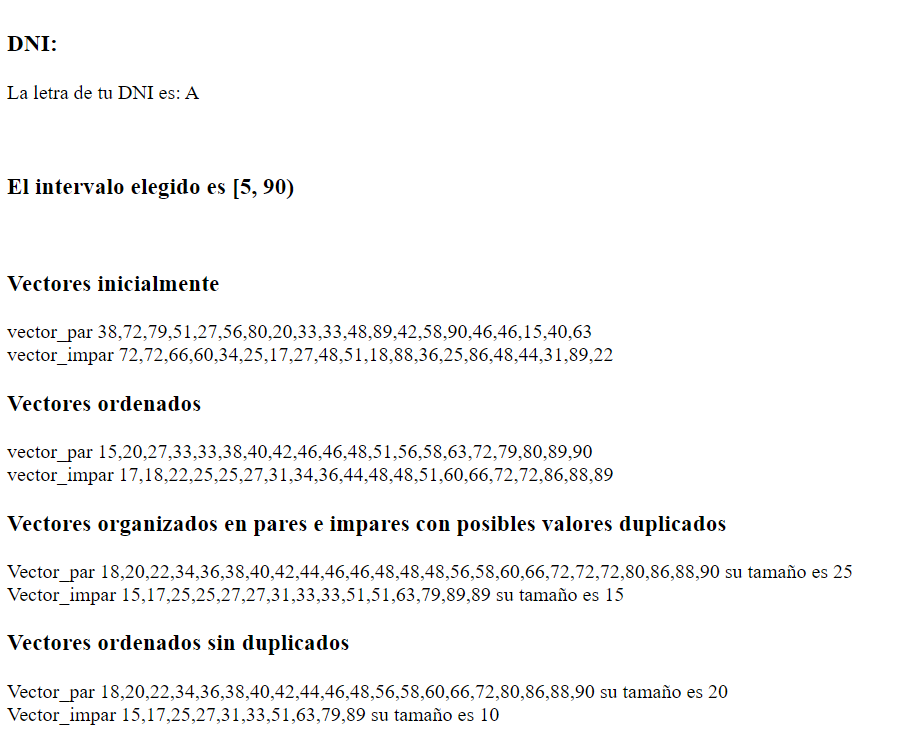

# Ejercicio 1.
- Realizar una función en JavaScript que solicite al usuario "Introduce tu número de DNI (sin la letra)" y calcular la letra del DNI. Para ello se facilita la siguiente información:

> `var letras = ['T', 'R', 'W', 'A', 'G', 'M', 'Y', 'F', 'P', 'D', 'X', 'B', 'N', 'J', 'Z', 'S', 'Q', 'V', 'H', 'L', 'C', 'K', 'E'];`

- Al Nº del DNI recogido por teclado, le hacemos el módulo % con el tamaño del array letras, y obtenemos la posición i, esa será la posición del array letras cuya letra le corresponde al DNI del usuario.

# Ejercicio 2.

- Realizar una función en JavaScript que realice los siguientes pasos:
    
    - Creamos dos vectores o arrays: uno par y otro impar.
    - Solicitamos al usuario "Introduzca el valor mínimo(incluído) del intervalo para generar números de forma aletoria".
    - Solicitamos al usuario "Introduzca el valor máximo(excluido) del intervalo para generar números de forma aleatoria".
    - Creamos una función aleatorio (min, max) {} que nos devuelva números aleatorios redondeados del intervalo [min, max). Usamos Math.random()
    - Le asignamos a cada vector 20 elementos aleatorios usando nuestra función.
    - Ordenamos ambos vectores de forma creciente, sort().
    - Creamos una función par_impar (vector_par, vector_impar) {} a la que le pasamos nuestros vectores y vamos analizando los valores, de manera que en un vector se queden todos los números pares y en otro vector todos los impares. Debes usar el operador de módulo o resto % para saber si el elemento que está en la posición i del vector es par o impar, si no es par pues lo pones al final del vector impar push() y lo eliminas de éste sin dejar hueco splice(), lo mismo con el vector impar.
    - Creamos un prototipo para el objeto Array, Array.prototype.Duplicados = function () {} lo que hace esta función es eliminar valores duplicados en el array. Puedes usar lastIndexOf y si encuentras una posición != i, quiere decir que existe uno duplicado y lo eliminas sin dejar hueco splice(). (Cuidado! Controla los tamaños porque llegado a este punto ambos vectores tendrán tamaños distintos)
    - Ordenamos ambos vectores de forma creciente, sort().
    - Mostramos ambos vectores ordenados, sin duplicados donde en uno están los números pares y en otro los impares.
    
## Ambos ejercicios deben estar en el mismo documento html. A continuación se muestra la apariencia que debería tener el programa:

